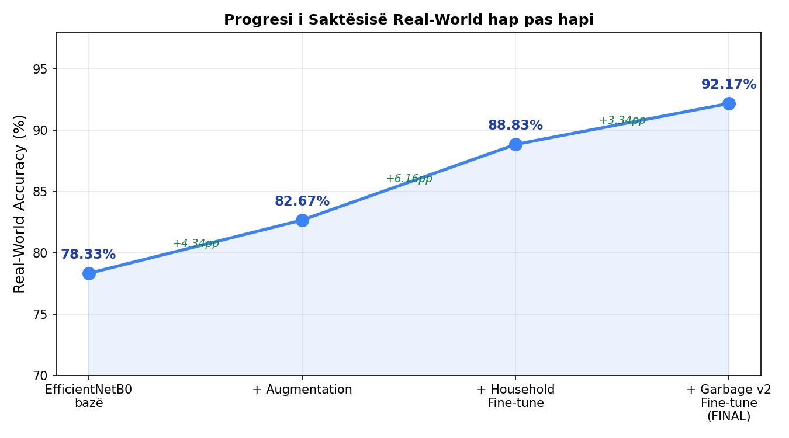
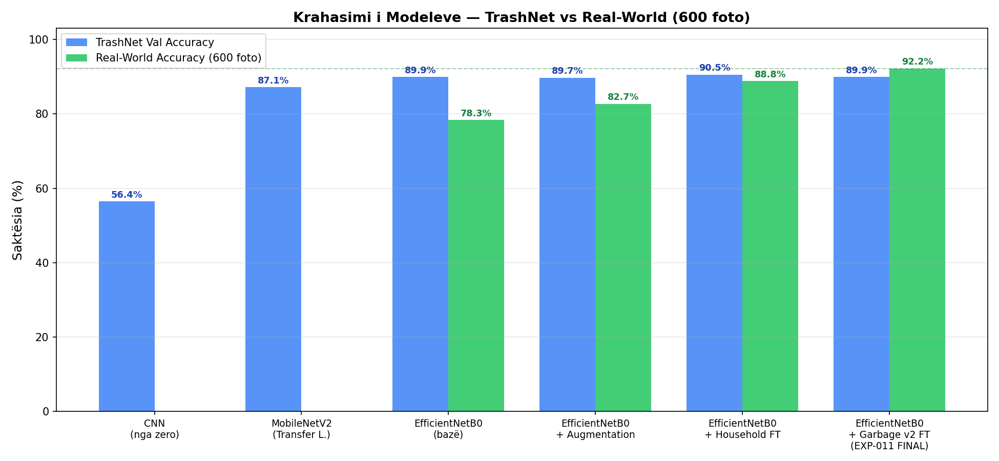
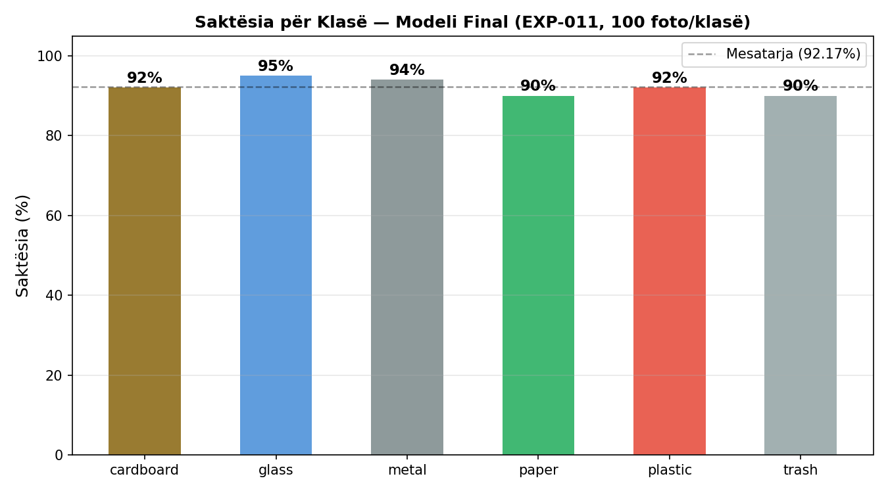

# Raport Progresi — Tema e Masterit
### Klasifikimi Automatik i Mbeturinave duke përdorur Deep Learning

**Studenti:** Era Kastrati  
**Mentori:** Bertan Karahoda  
**Data:** Korrik 2026

---

## Çfarë kam bërë?

Kam ndërtuar një sistem që **njeh automatikisht llojin e mbeturinës nga një foto**. Sistemi klasifikon mbeturinën në 6 kategori: karton, qelq, metal, letër, plastikë dhe mbeturinë e përgjithshme. Rezultati final: **92.2% saktësi** mbi 600 foto reale.

---

## Si funksionon?

Sistemi merr një foto, e analizon me rrjet nervor (EfficientNetB0) dhe thotë se cilës kategori i përket. Ky rrjet nervor është i trajnuar paraprakisht mbi miliona foto nga Google, pastaj unë e "specializova" për mbeturina.

---

## Dataset-et (të dhënat)

### TrashNet — dataset bazë
- **2,527 foto** të mbeturinave, 6 kategori
- Burimi: Kaggle
- Problem: foto të bëra në studio, sfond i bardhë — nuk duken si foto reale

### Pse shtova dataset-e të tjera?

Kur testova modelin e parë me foto reale (të bëra me telefon, në shtëpi), saktësia ishte vetëm **39%**. Arsyeja: modeli kishte mësuar vetëm foto "të pastra" nga studio, por nuk dinte të njihte mbeturina me sfonde normale.

Kjo quhet **"domain shift"** — modeli punon mirë në foto si ato me të cilat u trajnua, por dobët me foto të ndryshme reale.

**Zgjidhja:** Shtova dataset-e me foto reale për ta mësuar modelin "si duket bota e vërtetë":

| Dataset | Foto | Pse e shtova |
|---------|------|-------------|
| TACO | ~3,600 | Foto reale të mbeturinave në rrugë, parqe |
| RealWaste | ~3,900 | Foto nga ambiente reale depozieje |
| Household Waste | ~7,500 | Foto shtëpiake, objekte të zakonshme |
| Garbage v2 | ~17,000 | Dataset i larmishëm real-world (versioni final) |

---

## Eksperimentet — çfarë provova

Realizova **11 eksperimente** sistematike. Secili eksperiment ndërtohej mbi atë të mëparshmin:

| # | Çfarë bëra | Saktësia reale |
|---|-----------|----------------|
| 1 | CNN nga zero (modeli bazik) | ~30% |
| 2 | MobileNetV2 (model i gatshëm) | ~70% |
| 3 | **EfficientNetB0** (model i gatshëm) | 78.33% |
| 4 | + Foto me transformime (augmentation) | 82.67% |
| 5-8 | + Fine-tuning me dataset-e reale | 88.83% |
| 9 | + TTA (5 pamje të mesatarizuara) | 88.83% |
| 10 | Ensemble 3 modele ❌ | 85% (u keqësua) |
| **11** | **+ Garbage v2 fine-tune** | **92.17%** ✅ |

> **Shënim:** Eksperimenti 10 (kombinimi i 3 modeleve) dha rezultat më të keq — ishte "negative result" me vlerë akademike.

---

## Progresi i saktësisë hap pas hapi

Nga **78.33%** (EfficientNetB0 bazik) deri në **92.17%** (modeli final) — rritje prej **+13.84 pikë përqindje** vetëm duke shtuar dataset-e reale.

---

## Rezultati final

### Saktësia totale: 92.17% (553 nga 600 foto)

| Kategoria | Foto të sakta | Saktësia |
|-----------|--------------|----------|
| Qelq (glass) | 95/100 | **95%** |
| Metal | 94/100 | **94%** |
| Karton (cardboard) | 92/100 | **92%** |
| Plastikë (plastic) | 92/100 | **92%** |
| Letër (paper) | 90/100 | **90%** |
| Mbeturinë (trash) | 90/100 | **90%** |
| **TOTAL** | **553/600** | **92.17%** |

---

## Dataset-i real i testimit

Kam ndërtuar vetë një dataset me **600 foto reale** (100 për secilën kategori):
- Foto të bëra me telefon në ambiente normale
- Foto të zgjedhura nga interneti
- **Kurrë të përdorura gjatë trajnimit** — vetëm për testim final
- Foto të riemëruara qartë: `trash1.jpg` … `trash100.jpg`

---

## Aplikacioni Web

Ndërtova edhe një aplikacion web ku mund të ngarkosh një foto dhe sistemi të thotë menjëherë se çfarë mbeturine është.

**Teknologjia:** Python Flask + HTML/CSS  
**Funksionalitete:**
- Ngarkimi i fotos me drag & drop
- Rezultati në sekonda
- Grafik me besueshmërinë për të 6 kategoritë
- Këshillë riciklimi per kategori

---

## Krahasimi CNN nga zero vs Transfer Learning

| Qasja | Saktësia TrashNet |
|-------|------------------|
| CNN nga zero (unë) | 56.44% |
| MobileNetV2 (i gatshëm) | 87.13% |
| **EfficientNetB0 (i gatshëm)** | **89.90%** |

Transfer learning (përdorimi i modeleve të gatshme) jep rezultate dukshëm më të mira, veçanërisht kur dataset-i është i vogël.

---

## Gjetja kryesore

> Modeli i trajnuar vetëm me foto studio (TrashNet) performon keq me foto reale. Duke shtuar progresivisht dataset-e reale gjatë fine-tuning, saktësia real-world u rrit nga **78%** në **92%** — duke treguar se cilësia dhe larmia e dataset-it të trajnimit ka ndikim vendimtar.

---

## Çfarë mbetet (sugjerime)

Faza eksperimentale është e përfunduar. Mbetet dokumentimi i temës:

1. **Kapitulli teorik** — CNN, Transfer Learning, domain shift (literatura)
2. **Kapitulli metodologjia** — si u trajnua modeli, çfarë dataset-esh
3. **Kapitulli rezultatet** — tabelat dhe grafikët që i kemi
4. **Kapitulli diskutimi** — pse punon, pse gabon, kufizimet
5. **Konkluzionet** — çfarë arritëm, çfarë mund të bëhet më tej

**Sugjerime shtesë** nëse dëshiron t'i shtosh para mbrojtjes:
- Confusion matrix e modelit final (grafik i detajuar i gabimeve)
- Krahasim me punime të tjera akademike (tabela literatura)
- Shembuj vizualë: foto e ngarkuar → rezultati i sistemit (screenshot)

---

*Kodi burimor i plotë: `waste-classification-master-thesis/` (branch: dev)*  
*Model i gatshëm për demonstrim: `python app.py` → http://127.0.0.1:5000*
